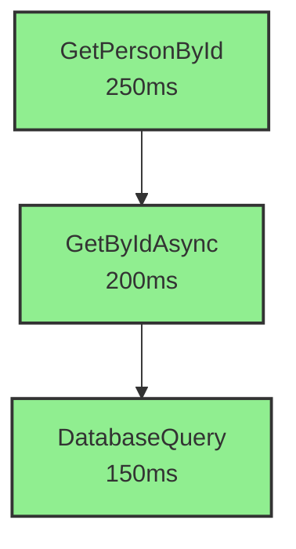

# DSMEnvelope Analytics & Persistence Guide

## Overview
This guide explains how to persist DSMEnvelopes to a database and analyze execution graphs using the built-in analytics engine. The system enables:

- **Graph Storage**: Store execution chains in Azure Cosmos DB
- **Execution Analysis**: Visualize request flows and identify bottlenecks
- **Performance Metrics**: Track execution times, success rates, and error patterns
- **Distributed Tracing**: Follow requests across services via ApiTraceId

## Architecture

### Data Flow
```
Pure Function → DSMEnvelope → Persistence Layer → Cosmos DB
                     ↓
              Analytics Engine → Insights/Graphs
```

### Key Components

1. **DSMEnvelopeDocument**: Optimized document model for database storage
2. **IDSMEnvelopeRepository**: Interface for querying and persistence
3. **CosmosDBEnvelopeRepository**: Cosmos DB implementation with efficient indexing
4. **DSMEnvelopeAnalytics**: Graph analysis and bottleneck detection
5. **Extension Methods**: Fluent API for persistence operations

## Setup

### 1. Install Azure Cosmos DB SDK

Add to your `.csproj`:

```xml
<PackageReference Include="Microsoft.Azure.Cosmos" Version="3.42.0" />
```

### 2. Configure Cosmos DB Connection

In `Program.cs` or `Startup.cs`:

```csharp
using NVL9.DSM.Core.Persistence;
using NVL9.DSM.Core.Persistence.CosmosDB;

// Initialize repository during startup
var connectionString = configuration["CosmosDB:ConnectionString"];
var repository = await CosmosDBEnvelopeRepository.CreateAsync(
    connectionString,
    databaseName: "DSMEnvelopeDB",
    containerName: "Envelopes",
    throughput: 400  // Minimum throughput for dev/test
);

// Configure for use in extension methods
DSMEnvelopePersistenceExtensions.ConfigureRepository(repository);

// Register as singleton for dependency injection
builder.Services.AddSingleton<IDSMEnvelopeRepository>(repository);
```

### 3. Connection String (appsettings.json)

```json
{
  "CosmosDB": {
    "ConnectionString": "AccountEndpoint=https://your-account.documents.azure.com:443/;AccountKey=your-key=="
  }
}
```

## Usage Patterns

### Pattern 1: Automatic Persistence with Success

```csharp
[HttpGet("{id}")]
public async Task<ActionResult<DSMEnvelope<PersonDto>>> GetPersonById(int id)
{
    var envelope = DSMEnvelope<PersonDto>
        .InitWithCaller(nameof(PersonController))
        .CaptureAndSetHeaders(HttpContext);
    
    try
    {
        var person = await _personService.GetByIdAsync(id);
        
        // Persist automatically when marking success
        await envelope.SuccessAndPersistAsync(person, includePayload: true);
        
        return Ok(envelope);
    }
    catch (Exception ex)
    {
        // Persist error state
        await envelope.CaptureExceptionAndPersistAsync(ex);
        return StatusCode(500, envelope);
    }
}
```

### Pattern 2: Manual Persistence Control

```csharp
[HttpPost]
public async Task<ActionResult<DSMEnvelope<PersonDto>>> CreatePerson(PersonCreateDto dto)
{
    var envelope = DSMEnvelope<PersonDto>
        .InitWithCaller(nameof(PersonController))
        .CaptureAndSetHeaders(HttpContext);
    
    try
    {
        var created = await _personService.CreateAsync(dto);
        envelope.Success(created);
        
        // Persist with custom options
        await envelope.PersistAsync(created, includePayload: false);
        
        return CreatedAtAction(nameof(GetPersonById), new { id = created.Id }, envelope);
    }
    catch (Exception ex)
    {
        envelope.CaptureException(ex);
        await envelope.PersistAsync<PersonDto>();  // Persist without payload
        return StatusCode(500, envelope);
    }
}
```

### Pattern 3: Service-Level Persistence

```csharp
public class PersonService
{
    private readonly IDSMEnvelopeRepository _repository;

    public PersonService(IDSMEnvelopeRepository repository)
    {
        _repository = repository;
    }

    public async Task<DSMEnvelope<PersonDto>> GetByIdAsync(int id)
    {
        var envelope = DSMEnvelope<PersonDto>.InitWithCaller(nameof(PersonService));
        
        try
        {
            var person = await _dbContext.Persons.FindAsync(id);
            if (person == null)
            {
                envelope.SetState(
                    DSMEnvelopeCodeManager.Manager.Find(DSMEnvelopeCodeEnum.API_APPVLD_02001),
                    $"Person {id} not found"
                );
            }
            else
            {
                envelope.Success(person);
            }
            
            // Persist at service layer
            await envelope.PersistAsync(person, includePayload: true);
            
            return envelope;
        }
        catch (Exception ex)
        {
            await envelope.CaptureExceptionAndPersistAsync(ex);
            return envelope;
        }
    }
}
```

## Querying & Analysis

### Query Examples

```csharp
public class EnvelopeAnalysisService
{
    private readonly IDSMEnvelopeRepository _repository;
    private readonly DSMEnvelopeAnalytics _analytics;

    public EnvelopeAnalysisService(IDSMEnvelopeRepository repository)
    {
        _repository = repository;
        _analytics = new DSMEnvelopeAnalytics();
    }

    // 1. Analyze a complete request execution graph
    public async Task<RequestExecutionAnalysis> AnalyzeRequestAsync(string rootEnvelopID)
    {
        var envelopes = await _repository.GetByRootEnvelopIDAsync(rootEnvelopID);
        var analysis = _analytics.BuildExecutionGraph(envelopes);
        
        Console.WriteLine($"Total Execution Time: {analysis.TotalExecutionTimeMs}ms");
        Console.WriteLine($"Total Nodes: {analysis.TotalNodes}");
        Console.WriteLine($"Max Depth: {analysis.MaxDepth}");
        Console.WriteLine($"Errors: {analysis.ErrorCount}");
        
        foreach (var bottleneck in analysis.Bottlenecks)
        {
            Console.WriteLine($"Bottleneck: {bottleneck.MethodName} - {bottleneck.ExecutionTimeMs}ms ({bottleneck.PercentOfTotal:F1}%)");
        }
        
        return analysis;
    }

    // 2. Track distributed request via ApiTraceId
    public async Task<List<DSMEnvelopeDocument>> TraceDistributedRequestAsync(string apiTraceId)
    {
        return await _repository.GetByApiTraceIdAsync(apiTraceId);
    }

    // 3. Find slow methods
    public async Task<List<DSMEnvelopeDocument>> FindSlowMethodsAsync(long thresholdMs = 1000)
    {
        return await _repository.GetSlowExecutionsAsync(thresholdMs, limit: 50);
    }

    // 4. Analyze method performance over time
    public async Task<MethodStatistics> GetMethodStatsAsync(string methodName)
    {
        var envelopes = await _repository.GetByMethodNameAsync(methodName, limit: 1000);
        return _analytics.CalculateMethodStatistics(envelopes);
    }

    // 5. Generate Mermaid graph for visualization
    public async Task<string> GenerateMermaidGraphAsync(string rootEnvelopID)
    {
        var analysis = await AnalyzeRequestAsync(rootEnvelopID);
        return _analytics.ExportToMermaid(analysis);
    }
}
```

### Analysis Output Example

```csharp
var analysis = await _analysisService.AnalyzeRequestAsync("AppId|Hostname|2026:01:26:10:30:45:123:+300|12345");

// Output:
// Total Execution Time: 2500ms
// Total Nodes: 8
// Max Depth: 3
// Errors: 1
// 
// Bottlenecks:
// - DatabaseQuery.GetPersons - 1800ms (72.0% of total)
// - ValidationService.ValidateInput - 550ms (22.0% of total)
//
// Critical Path:
// PersonController.GetAll → PersonService.GetAll → DatabaseQuery.GetPersons → DB.ExecuteQuery
```

## Visualization

### Mermaid Graph Export

Generate a visual graph of execution flow:

```csharp
var mermaidCode = await _analysisService.GenerateMermaidGraphAsync(rootEnvelopID);
Console.WriteLine(mermaidCode);
```

Output:


Use this in documentation, dashboards, or debugging tools.

## Analytics Capabilities

### 1. Bottleneck Detection
Automatically identifies Pure Functions consuming >20% of total execution time:

```csharp
var bottlenecks = analysis.Bottlenecks;
// Returns: { MethodName, ExecutionTime, PercentOfTotal, Reason }
```

### 2. Critical Path Analysis
Finds the longest execution path through the graph:

```csharp
var criticalPath = analysis.CriticalPath;
// Returns: List of nodes in the slowest execution branch
```

### 3. Error Propagation Tracking
Traces where errors originated and propagated:

```csharp
var errors = analysis.Errors;
// Returns: All error nodes in execution order
```

### 4. Method Statistics (Aggregated)
Calculate performance metrics across multiple requests:

```csharp
var stats = await _analysisService.GetMethodStatsAsync("GetByIdAsync");
// Returns:
// - TotalCalls, SuccessRate, ErrorCount
// - Min, Max, Avg, Median, P95, P99 execution times
// - Error code distribution
```

### 5. Time-Series Analysis
Query envelopes within time ranges for trend analysis:

```csharp
var envelopes = await _repository.GetByTimeRangeAsync(
    DateTimeOffset.UtcNow.AddHours(-1),
    DateTimeOffset.UtcNow,
    limit: 5000
);
```

## Database Schema Design

### Cosmos DB Container Configuration

**Partition Key**: `partitionKey` (maps to `RootEnvelopID`)
- Ensures all envelopes for a request are in the same logical partition
- Enables efficient single-partition queries for graph traversal

**Indexing Strategy**:
- Automatic indexing on all properties
- Composite indexes for:
  - `startTime` + `executionTimeMs` (time-range queries)
  - `methodName` + `startTime` (method performance analysis)

**Document Structure**:
```json
{
  "id": "12345678_90ab_cdef_1234_567890abcdef_12345",
  "partitionKey": "AppId|Hostname|2026:01:26:10:30:45:123:+300|12345",
  "uniqueIEID": "12345678-90ab-cdef-1234-567890abcdef|12345",
  "rootEnvelopID": "AppId|Hostname|2026:01:26:10:30:45:123:+300|12345",
  "parentEnvelopID": "parent-unique-id",
  "apiTraceId": "trace-abc-123",
  "code": "GEN_COMMON_00000",
  "codeValue": 0,
  "message": "Success",
  "executionTimeMs": 250,
  "startTime": "2026-01-26T10:30:45.123Z",
  "endTime": "2026-01-26T10:30:45.373Z",
  "className": "PersonController",
  "methodName": "GetPersonById",
  "filePath": "D:\\Controllers\\PersonController.cs",
  "lineNumber": 42,
  "depth": 0,
  "isError": false,
  "isSuccess": true
}
```

## Advanced Scenarios

### Multi-Service Distributed Tracing

When calling across services, propagate headers:

```csharp
// Service A
var envelope = DSMEnvelope<DataDto>
    .InitWithCaller(nameof(ServiceA))
    .CaptureAndSetHeaders(HttpContext);

// Pass trace ID to Service B
var request = new HttpRequestMessage(HttpMethod.Get, "https://serviceb/api/data");
request.Headers.Add("Api-Trace-Id", envelope.ApiTraceId);

// Service B receives and captures same trace ID
var envelopeB = DSMEnvelope<DataDto>
    .InitWithCaller(nameof(ServiceB))
    .CaptureAndSetHeaders(HttpContext);

// Query all services by trace ID
var allEnvelopes = await _repository.GetByApiTraceIdAsync(envelope.ApiTraceId);
```

### Real-Time Monitoring Dashboard

```csharp
// Get recent errors
var recentErrors = await _repository.GetByTimeRangeAsync(
    DateTimeOffset.UtcNow.AddMinutes(-5),
    DateTimeOffset.UtcNow
);
var errorCount = recentErrors.Count(e => e.IsError);

// Get slow executions in last hour
var slowOps = await _repository.GetSlowExecutionsAsync(1000, limit: 10);

// Calculate success rate for critical method
var stats = await _analysisService.GetMethodStatsAsync("ProcessPayment");
Console.WriteLine($"Success Rate: {stats.SuccessRate:F2}%");
```

### Data Retention Management

```csharp
// Delete envelopes older than 30 days
var cutoff = DateTimeOffset.UtcNow.AddDays(-30);
var deletedCount = await _repository.DeleteOlderThanAsync(cutoff);
Console.WriteLine($"Deleted {deletedCount} old envelopes");
```

## Performance Considerations

### 1. Partition Key Strategy
- All envelopes for a request share the same `RootEnvelopID` partition
- Enables efficient single-partition queries (low RU cost)
- Supports up to 20GB per logical partition (typically 100K+ envelopes)

### 2. Indexing Optimization
- Composite indexes reduce query costs for common patterns
- Disable indexing on large payload fields if not queried

### 3. Throughput Sizing
- **Dev/Test**: 400 RU/s (minimum)
- **Production**: Start with 1000 RU/s, scale based on metrics
- Use autoscale for variable workloads

### 4. Payload Storage
- Set `includePayload: false` for high-volume methods
- Only persist payloads for debugging or audit requirements

### 5. Bulk Operations
- Use `SaveBatchAsync()` for bulk inserts (better throughput)
- Process in batches of 100-500 documents

## Best Practices

1. **Persist at Boundaries**: Persist envelopes at Controller and Service layers, not in every internal method
2. **Use ApiTraceId**: Always capture HTTP headers for distributed tracing
3. **Selective Payload Storage**: Only store payloads when needed for debugging/audit
4. **Monitor Throughput**: Use Cosmos DB metrics to optimize RU allocation
5. **Retention Policies**: Implement automated cleanup for old data
6. **Parent-Child Linking**: Always set `ParentEnvelopID` for accurate graph construction
7. **Error Indexing**: Use `isError` field for fast error queries
8. **Depth Calculation**: Let the persistence layer calculate depth automatically

## Integration with Existing Code

No changes needed to existing DSMEnvelope usage. Simply add persistence calls:

```csharp
// Before (existing code)
envelope.Success(result);
return Ok(envelope);

// After (with persistence)
await envelope.SuccessAndPersistAsync(result);
return Ok(envelope);
```

## Next Steps

1. **Set up Cosmos DB**: Create database and container
2. **Configure Repository**: Initialize in `Program.cs`
3. **Add Persistence Calls**: Use extension methods in Controllers/Services
4. **Build Dashboards**: Query repository for insights
5. **Visualize Graphs**: Export Mermaid diagrams for documentation
6. **Set Up Alerts**: Monitor error rates and slow executions

## Example Dashboard Queries

```csharp
// System Health Overview
var last5Min = DateTimeOffset.UtcNow.AddMinutes(-5);
var recentEnvelopes = await _repository.GetByTimeRangeAsync(last5Min, DateTimeOffset.UtcNow);
var successRate = recentEnvelopes.Count(e => e.IsSuccess) / (double)recentEnvelopes.Count * 100;

// Top 10 Slowest Methods
var slowMethods = await _repository.GetSlowExecutionsAsync(500, limit: 10);

// Error Rate by Method
var errorsByMethod = recentEnvelopes
    .Where(e => e.IsError)
    .GroupBy(e => e.MethodName)
    .Select(g => new { Method = g.Key, Count = g.Count() })
    .OrderByDescending(x => x.Count);
```

This infrastructure provides complete observability into your application's execution flow, enabling data-driven optimization and rapid issue diagnosis.
