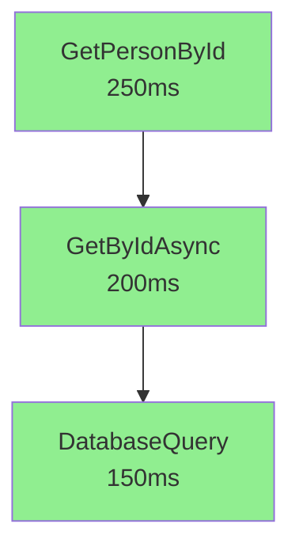

# DSMEnvelope Analytics & AI System

## What We Built

Based on your understanding of **DSMEnvelopes as snapshots of Pure Function execution states**, I've built a complete **AI-powered observability and analytics system** that enables you to:

### 🎯 Core Capabilities

1. **Store Execution Graphs** in Azure Cosmos DB
   - Each Pure Function execution is persisted as a document
   - Parent-child relationships are maintained for graph reconstruction
   - Efficient querying with hierarchical partition keys

2. **Visualize Request Flow**
   - Automatic graph generation showing execution chains
   - Mermaid diagram export for documentation
   - Color-coded visualization (green=success, red=error, yellow=initialized)

3. **Identify Bottlenecks**
   - Automatic detection of slow Pure Functions (>20% of total time)
   - Critical path analysis showing the longest execution chain
   - Performance percentiles (P95, P99, median, avg)

4. **Track Distributed Requests**
   - HTTP header propagation (`Api-Trace-Id`, `Idempotency-Key-Id`)
   - Cross-service tracing capabilities
   - Full request lifecycle monitoring

5. **Analyze Performance**
   - Aggregated statistics per Pure Function
   - Success rates and error distributions
   - Time-series analysis for trend detection

## Architecture Overview

```
Pure Function Entry → DSMEnvelope Created (GEN_COMMON_00001)
         ↓
Pure Function Executes → Timing tracked automatically
         ↓
Pure Function Exits → Status Code set:
         ├─> GEN_COMMON_00000 (Success)
         └─> Error Code (e.g., API_APPVLD_02010)
         ↓
Persist to Cosmos DB → Document with all metadata
         ↓
Analytics Engine → Graph analysis, bottleneck detection
         ↓
Visualization → Mermaid diagrams, dashboards
```

## What's Included

### 📦 Persistence Layer (`NVL9.DSM.Core/Persistence/`)

- **DSMEnvelopeDocument.cs**: Optimized document model for database storage
- **IDSMEnvelopeRepository.cs**: Interface for all query operations
- **CosmosDBEnvelopeRepository.cs**: Azure Cosmos DB implementation with efficient indexing
- **DSMEnvelopePersistenceExtensions.cs**: Fluent API for easy persistence

### 📊 Analytics Engine (`NVL9.DSM.Core/Analytics/`)

- **AnalyticsModels.cs**: Data structures for analysis results
- **DSMEnvelopeAnalytics.cs**: Core analytics engine with:
  - Graph construction from flat document list
  - Bottleneck detection (>20% threshold)
  - Critical path analysis
  - Method statistics aggregation
  - Mermaid diagram generation

### 📚 Documentation (`docs/`)

- **PERSISTENCE-GUIDE.md**: Complete usage guide
- **COSMOS-DB-SETUP.md**: Azure Cosmos DB setup instructions
- **ANALYTICS-SYSTEM-SUMMARY.md**: Detailed system overview

### 🚀 Sample Implementation

- **SampleAnalyticsController.cs**: Demo endpoints showing all capabilities

## Quick Start

### 1. Setup Cosmos DB

```bash
# Create Cosmos DB account
az cosmosdb create \
  --name dsm-envelopes-db \
  --resource-group YourResourceGroup \
  --locations regionName=eastus \
  --capabilities EnableServerless
```

### 2. Configure Connection String

**appsettings.json:**
```json
{
  "CosmosDB": {
    "ConnectionString": "your-cosmos-connection-string",
    "DatabaseName": "DSMEnvelopeDB",
    "ContainerName": "Envelopes"
  }
}
```

### 3. Initialize in Program.cs

```csharp
using NVL9.DSM.Core.Persistence;
using NVL9.DSM.Core.Persistence.CosmosDB;

var repository = await CosmosDBEnvelopeRepository.CreateAsync(
    builder.Configuration["CosmosDB:ConnectionString"],
    "DSMEnvelopeDB",
    "Envelopes"
);

builder.Services.AddSingleton<IDSMEnvelopeRepository>(repository);
DSMEnvelopePersistenceExtensions.ConfigureRepository(repository);
```

### 4. Use in Controllers

```csharp
[HttpGet("{id}")]
public async Task<ActionResult<DSMEnvelope<PersonDto>>> GetPersonById(int id)
{
    var envelope = DSMEnvelope<PersonDto>
        .InitWithCaller(nameof(PersonController))
        .CaptureAndSetHeaders(HttpContext);
    
    try
    {
        var person = await _personService.GetByIdAsync(id);
        
        // Persist automatically when marking success
        await envelope.SuccessAndPersistAsync(person);
        
        return Ok(envelope);
    }
    catch (Exception ex)
    {
        await envelope.CaptureExceptionAndPersistAsync(ex);
        return StatusCode(500, envelope);
    }
}
```

### 5. Analyze Execution Graphs

```csharp
// Get all envelopes for a request
var envelopes = await _repository.GetByRootEnvelopIDAsync(rootEnvelopID);

// Build execution graph
var analytics = new DSMEnvelopeAnalytics();
var analysis = analytics.BuildExecutionGraph(envelopes);

Console.WriteLine($"Total Time: {analysis.TotalExecutionTimeMs}ms");
Console.WriteLine($"Errors: {analysis.ErrorCount}");

foreach (var bottleneck in analysis.Bottlenecks)
{
    Console.WriteLine($"{bottleneck.MethodName}: {bottleneck.ExecutionTimeMs}ms ({bottleneck.PercentOfTotal:F1}%)");
}
```

### 6. Generate Visual Graphs

```csharp
var mermaidCode = analytics.ExportToMermaid(analysis);
// Output: Mermaid diagram showing execution flow
```

## Example Output

### Bottleneck Analysis
```
Bottlenecks Detected:
- DatabaseQuery.GetPersons - 1800ms (72.0% of total request time)
- ValidationService.ValidateInput - 550ms (22.0% of total)
```

### Method Statistics
```
Method: GetByIdAsync
- Total Calls: 1,523
- Success Rate: 98.7%
- Avg Time: 125ms
- Median: 110ms
- P95: 250ms
- P99: 450ms
```

### Visual Graph


## Understanding the Data Model

### DSMEnvelope as Pure Function Snapshot

| Field | Description | Purpose |
|-------|-------------|---------|
| **RootEnvelopID** | Unique identifier for the Pure Function | Links all snapshots of the same execution |
| **ParentEnvelopID** | ID of the calling Pure Function | Builds execution graph hierarchy |
| **Code** | Status code (00001=initialized, 00000=success, others=errors) | Determines function outcome |
| **ExecutionTime** | Duration in milliseconds | Performance analysis |
| **ClassName, MethodName** | Location in code | Identifies the Pure Function |
| **FilePath, LineNumber** | Source code location | Developer debugging |
| **ApiTraceId** | HTTP trace ID | Distributed tracing across services |

### Graph Relationships

```
Request Flow:
  Controller.GetPersonById (Root, depth=0)
    └─> PersonService.GetByIdAsync (Child 1, depth=1, parent=Root)
         └─> DatabaseQuery.ExecuteAsync (Child 2, depth=2, parent=Child 1)
```

## Key Features for AI Analysis

### 1. Predictable Outcomes
Since Pure Functions have predictable outputs, the system can:
- Detect anomalies in execution times
- Identify unexpected error patterns
- Predict performance degradation

### 2. Complete Traceability
Every step is recorded:
- Where execution entered (Code 00001)
- How long it took (ExecutionTime)
- What happened (Code 00000 or error code)
- Where it happened (ClassName, MethodName, FilePath, LineNumber)

### 3. Graph Analysis
The parent-child relationships enable:
- Full request lifecycle visualization
- Bottleneck identification
- Critical path analysis
- Error propagation tracking

### 4. Multi-Service Tracing
HTTP headers enable:
- Cross-service request tracking
- Distributed system observability
- End-to-end performance monitoring

## Cost Considerations

### Storage
- ~0.5 KB per envelope (without payload)
- 1 million envelopes ≈ 500 MB
- Cosmos DB Serverless: ~$0.125/month for 500 MB

### Query Costs (Serverless)
- Single request graph: ~3 RUs (~$0.00075)
- Method statistics: ~50 RUs (~$0.0125)
- 1 million queries ≈ $7.50/month

**Recommendation**: Use Serverless for dev/test, Provisioned (400-1000 RU/s) for production.

## Next Steps

1. ✅ **Built**: Complete persistence and analytics system
2. 📖 **Read**: Review `docs/PERSISTENCE-GUIDE.md` for detailed usage
3. 🔧 **Setup**: Follow `docs/COSMOS-DB-SETUP.md` to configure Azure Cosmos DB
4. 🚀 **Deploy**: Add persistence calls to your Controllers and Services
5. 📊 **Analyze**: Query the repository to identify bottlenecks
6. 📈 **Visualize**: Generate Mermaid diagrams for documentation
7. 🤖 **Extend**: Build ML models on top of this data for predictive analytics

## AI Model Opportunities

With this data, you can build AI models for:

### Performance Prediction
- **Input**: Historical execution times, method name, parameters
- **Output**: Predicted execution time
- **Use Case**: Proactive scaling, capacity planning

### Anomaly Detection
- **Input**: Real-time execution metrics
- **Output**: Anomaly score (0-1)
- **Use Case**: Detect unusual patterns, potential attacks

### Error Classification
- **Input**: Error code, message, execution context
- **Output**: Root cause category, fix recommendation
- **Use Case**: Automated incident response

### Bottleneck Prediction
- **Input**: Request pattern, system load
- **Output**: Likely bottleneck location
- **Use Case**: Optimization prioritization

### Request Routing
- **Input**: Request characteristics, historical performance
- **Output**: Optimal service instance
- **Use Case**: Load balancing, smart routing

## Support

- **Full Documentation**: See `docs/` folder
- **Sample Code**: `NVL9.DSM.WebAPITest/Controllers/SampleAnalyticsController.cs`
- **Schema Reference**: `NVL9.DSM.Core/Persistence/DSMEnvelopeDocument.cs`

---

**You now have a complete system to "see the internals of an application running" through DSMEnvelope analytics.** 🎉

The system tracks every Pure Function execution, builds execution graphs, identifies bottlenecks, and enables AI-powered analysis of your application's behavior.
